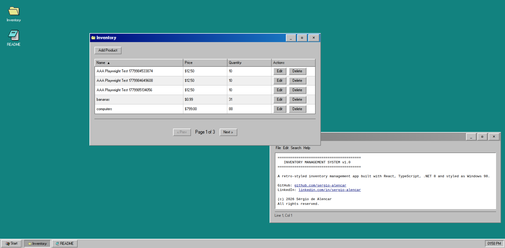
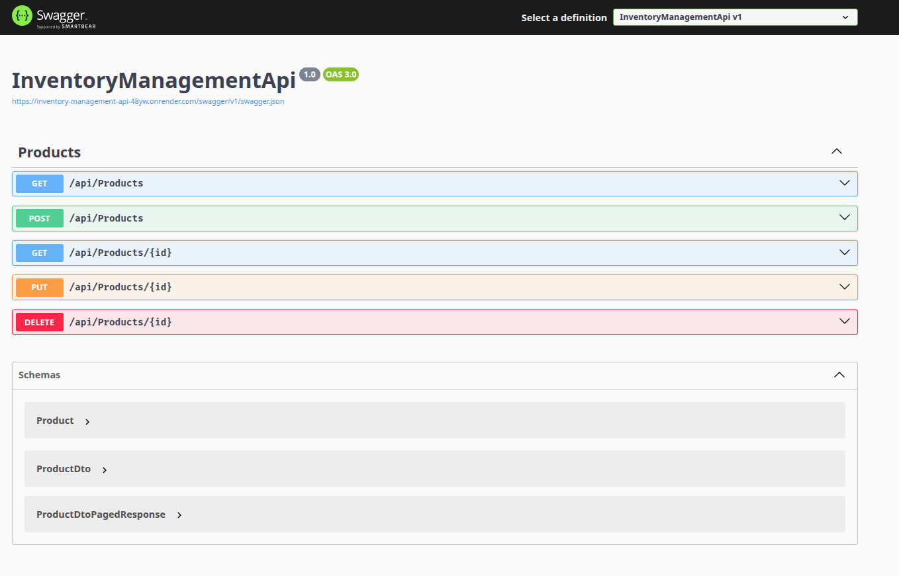

# Inventory Management System

A full‑stack **inventory management** application with a retro **Windows 98** aesthetic, built with **.NET 8**, **React**, **TypeScript**, and **PostgreSQL**. The project showcases modern development practices including automated testing (unit + E2E), CI/CD pipelines, Docker containerization, and a clean, professional architecture.

---

## Live Demo

| Environment     | URL                                                                                                                      |
| --------------- | ------------------------------------------------------------------------------------------------------------------------ |
| **Frontend**    | [https://gestaodeinventario.vercel.app](https://gestaodeinventario.vercel.app)                                           |
| **Backend API** | [https://inventory-management-api-48yw.onrender.com/api](https://inventory-management-api-48yw.onrender.com/api)         |
| **Swagger UI**  | [https://inventory-management-api-48yw.onrender.com/swagger](https://inventory-management-api-48yw.onrender.com/swagger) |

---

## CI/CD Status

[](https://github.com/sergio-alencar/inventory-management-api/actions/workflows/ci.yml)

- **Backend**: Build + unit tests (xUnit, Moq, FluentAssertions)
- **Frontend**: E2E tests (Playwright) running against the production API

---

## Preview





---

## Tech Stack

### Backend

- **.NET 8** – ASP.NET Core Web API
- **Entity Framework Core** 8 + **PostgreSQL** (Supabase)
- **AutoMapper** for DTO mapping
- **Serilog** for structured logging
- **Swagger** (Swashbuckle) for API documentation
- **xUnit** + **Moq** + **FluentAssertions** for unit testing
- **Docker** multi‑stage build

### Frontend

- **React 19** + **TypeScript**
- **Vite** for build tooling
- **Tailwind CSS** with custom retro Windows 98 theme
- **Axios** with interceptors for API communication
- **Playwright** for end‑to‑end testing

### DevOps & Hosting

- **GitHub Actions** – CI/CD pipeline
- **Render** – Backend (Docker Web Service)
- **Vercel** – Frontend (static site)
- **Supabase** – Managed PostgreSQL

---

## Architecture

```
┌─────────────────────────────────────────────────┐
│             React Frontend (Vercel)             │
│  ┌────────────┐ ┌───────┐ ┌──────────────────┐  │
│  │ Components │ │ Hooks │ │ Windows 98 theme │  │
│  └────────────┘ └───────┘ └──────────────────┘  │
└─────────────────────┼───────────────────────────┘
                      │ HTTPS
                      ▼
┌─────────────────────────────────────────────────┐
│          ASP.NET Core Web API (Render)          │
│ ┌─────────────┐  ┌──────────┐  ┌──────────────┐ │
│ │ Controllers │──│ Services │──│ Repositories │ │
│ └─────────────┘  └──────────┘  └──────────────┘ │
│                     │                           │
│                   EF Core                       │
└─────────────────────┼───────────────────────────┘
                      │
                      ▼
┌─────────────────────────────────────────────────┐
│         PostgreSQL Database (Supabase)          │
└─────────────────────────────────────────────────┘
```

---

## Project Structure

```
inventory-management-api/
├── InventoryManagementApi/ # .NET 8 backend
│ ├── Controllers/
│ ├── Data/ (DbContext, Repositories)
│ ├── Models/ (Entities, DTOs, PagedResponse)
│ ├── Services/
│ ├── Middleware/
│ ├── Migrations/
│ ├── Program.cs
│ ├── Dockerfile
│ └── InventoryManagementApi.Tests/ # xUnit test project
│
├── inventory-management-ui/ # React frontend
│ ├── src/
│ │ ├── components/ (desktop, taskbar, windows, inventory, shared, icons)
│ │ ├── hooks/ (useProducts, useWindowManager, useProductForm)
│ │ ├── services/ (api.ts)
│ │ ├── types/
│ │ └── App.tsx
│ ├── tests/ # Playwright E2E tests
│ └── playwright.config.ts
│
└── .github/workflows/ci.yml # CI Pipeline
```

---

## Getting Started (Local)

### Prerequisites

- [.NET 8 SDK](https://dotnet.microsoft.com/en-us/download/dotnet/8.0)
- [Node.js 20+](https://nodejs.org/)
- [PostgreSQL](https://www.postgresql.org/) (or use Supabase free tier)

### Backend

```bash
cd InventoryManagementApi

# Update connection string in appsettings.Development.json or set env var
export DATABASE_URL="Host=localhost;Port=5432;Database=inventory_db;Username=postgres;Password=yourpass"

# Apply migrations
dotnet ef database update

# Run the API
dotnet run

# Swagger available at http://localhost:5155/swagger
```

### Frontend

```bash
cd inventory-management-ui

# Install dependencies
npm install

# Set the API URL (local or production)
export VITE_API_URL=http://localhost:5155/api

# Start dev server
npm run dev

# Open http://localhost:5173
```

## Running Tests

### Unit Tests (Backend)

```bash
cd InventoryManagementApi
dotnet test
```

### E2E Tests (Frontend)

```bash
cd inventory-management-ui
npm run test:e2e:render    # uses production API
# or for local API:
npm run test:e2e:local
```

## Key Features

- Full CRUD for inventory products

- Pagination & dynamic sorting (by name, price, quantity)

- Retro Windows 98 desktop – draggable windows, taskbar, Notepad

- DTOs with AutoMapper – clean separation of concerns

- Global error handling middleware + Axios interceptors

- Structured logging with Serilog

- Unit tests covering service layer (xUnit + Moq)

- E2E tests with Playwright (Chromium)

- CI/CD pipeline on GitHub Actions (build, test, deploy)

- Swagger documentation in all environments

- Docker multi‑stage build for the backend

## License

This project is open source and available under the [MIT License](https://opensource.org/license/mit).

## Author

**Sérgio de Alencar**

[GitHub](https://github.com/sergio-alencar) | [LinkedIn](https://www.linkedin.com/in/sergio-alencar/)
