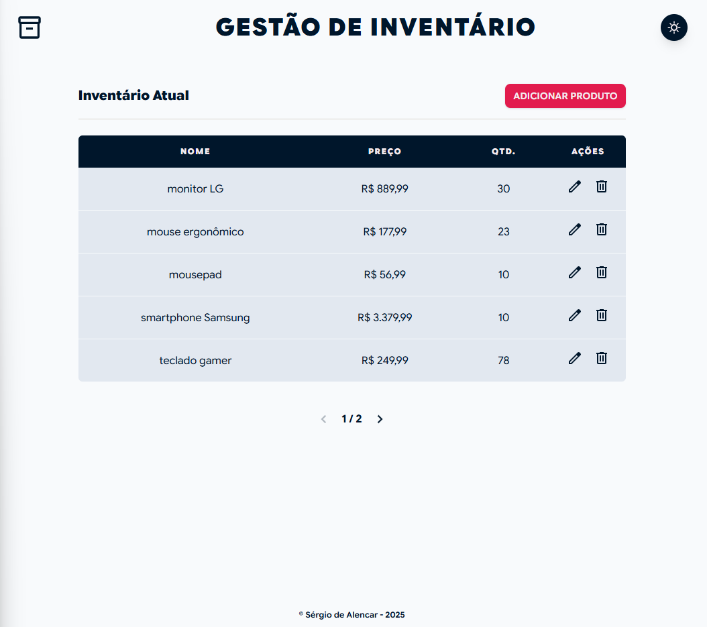
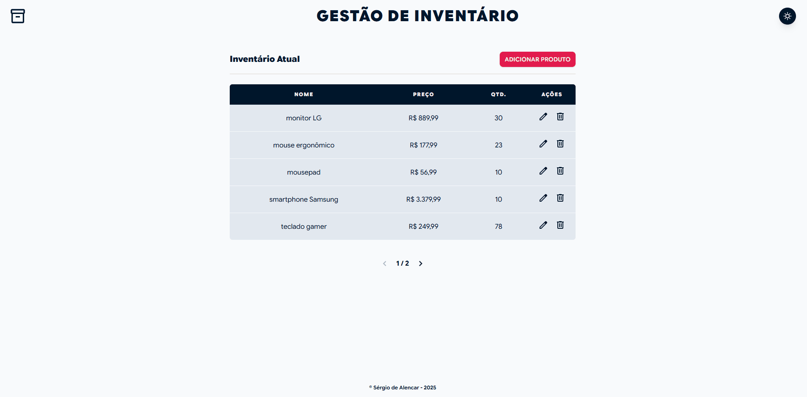

# **Gestão de Inventário (Fullstack)**

Sistema de gestão de inventário desenvolvido para demonstrar competências em C# (.NET) e React com TypeScript. O projeto foca em boas práticas de arquitetura, tipagem e UX fluida.

## **Tecnologias Utilizadas**

### **Backend**

- C# / .NET 8: Framework para construção da API
- Entity Framework Core: ORM para manipulação da base de dados
- Repository Pattern: Padronização do acesso a dados e isolamento da lógica de negócio
- SQLite/SQL Server: Persistência de dados
- Swagger/OpenAPI: Documentação interativa da API

### **Frontend**

- React (Vite): Biblioteca para interface declarativa
- TypeScript: Tipagem estática para evitar erros em tempo de execução e melhorar a manutenção
- Tailwind CSS: Estilização moderna e responsiva
- Axios: Cliente HTTP para comunicação com a API
- Context API: Gestão de estado global (Tema Dark/Light)

## **Funcionalidades Principais**

- CRUD Completo: Criação, listagem, edição e exclusão de produtos
- Paginação: Implementada no backend e drontend para performance com grandes volumes de dados
- Modo Escuro: Interface adaptável à preferência do usuário
- Validação de Formulários: Garantia de integridade de dados no cliente e no servidor
- Feedback ao Usuário: Modais de confirmação, estados de carregamento e tratamento de erros

## **Arquitetura do Projeto**

O projeto foi construído seguindo o fluxo moderno de desenvolvimento:

- Backend (API): Segue o princípio de responsabilidade única; os controllers recebem as requisições e delegam a lógica de persistência aos repositories
- Frontend (UI): Organizado por componentes reutilizáveis; a tipagem é centralizada em interfaces TypeScript, garantindo que o objeto Product seja consistente em toda a aplicação

## **Como Executar o Projeto**

### **Pré-requisitos**

- .NET SDK (versão 8.0+)
- Node.js (versão 18+)

### **Passo 1: Backend**

    cd InventoryManagementApi
    dotnet restore
    dotnet run

A API estará disponível em: http://localhost:5155 (ou na porta configurada).

### **Passo 2: Frontend**

    cd inventory-management-ui
    npm install
    npm run dev

O site estará disponível em: http://localhost:5173.

## Imagens

")

## **Autor**

Sérgio de Alencar - [LinkedIn](https://www.linkedin.com/in/sergio-alencar/) | [GitHub](https://github.com/sergio-alencar)
